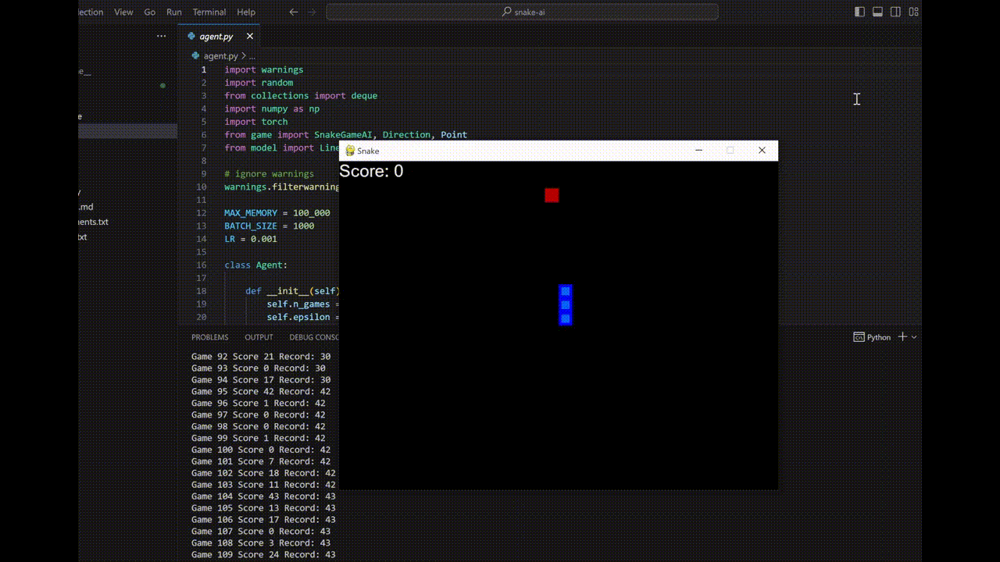

# 🐍 Snake AI

Snake AI is a project that implements deep reinforcement learning to train an agent to play the classic Snake game. The agent learns to navigate the game environment, avoiding collisions with the snake's own body and walls while maximizing its score by consuming food.

## Project Structure

```
|-- Snake AI
|   |-- agent.py
|   |-- arial.ttf
|   |-- game.py
|   |-- model.py
|   |-- requirements.txt
|   |-- runtime.txt
```

- **agent.py**: Contains the implementation of the reinforcement learning agent, which includes the Q-learning model, training methods, and the main training loop.

- **arial.ttf**: A font file used for rendering text in the game.

- **game.py**: Implements the SnakeGameAI class, representing the game environment, including the snake, food, and game logic.

- **model.py**: Defines the architecture of the linear Q-network and the QTrainer class responsible for training the model.

- **requirements.txt**: Specifies the project dependencies.

- **runtime.txt**: Indicates the Python version to be used for the project.

## Getting Started

1. Clone the repository:

   ```bash
   git clone https://github.com/henalon0/snake-ai.git
   ```

2. Create a virtual environment and install dependencies:

   ```bash
   cd snake-ai
   python -m venv venv
   source venv/bin/activate  # On Windows, use 'venv\Scripts\activate'
   pip install -r requirements.txt
   ```

3. Run the training script:

   ```bash
   python agent.py
   ```

## Training

The `agent.py` script contains the main training loop for the Snake AI agent. The agent learns to play the Snake game using deep reinforcement learning. Training progress is displayed, and the best-performing model is saved.

## Results

Training results, including game scores are displayed during and after training. The best-performing model is saved and can be used for inference.

Feel free to explore and modify the code to enhance the agent's learning capabilities or adapt it for other environments.

**Note:** This README assumes that you have Python and Git installed on your system.

Enjoy training your Snake AI agent! 🐍🕹️
